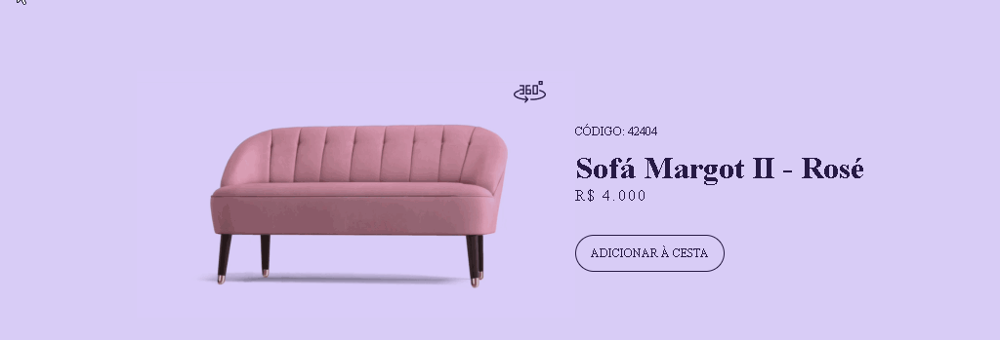

# <h1 align="center"> BoraCodar um card de produto por Leon Krenak</h1>

Eu sempre acredito que a melhor maneira de aprender é colocando as mãos na massa, e hoje cai sem querer na hashtag #boracodar e decidi me desafiar. Assisti ao vídeo do [@maykbrito](https://github.com/maykbrito) e comecei a trabalhar. Foi desafiador, especialmente na parte do CSS, mas a parte do JavaScript foi incrivelmente fluida. Não tenho dúvida que este desafio me ensinou muito e já estou ansioso para o próximo! #programação #javascript #boraCodar

# <h2 align="center">Demonstração do Projeto</h2>

   
 Versão sem Glassmorphism

# <h2 align="center">Como foi pensado a lógica do script?</h2>

Esse código controla a exibição de uma imagem de um sofá através do evento "click" em um botão. Ele alterna entre uma imagem estática e uma animada, alterando a fonte e a classe do elemento. Foi usado o método "getElementsByClassName" para obter o elemento, "setAttribute" para alterar a fonte e a classe e "addEventListener" para adicionar o evento "click" ao botão.

# <h2 align="center"> Tecnologias usadas</h2>

# <h2 align="center">Autores</h2>
[@Leonkoc](https://www.github.com/Leonkoc)
